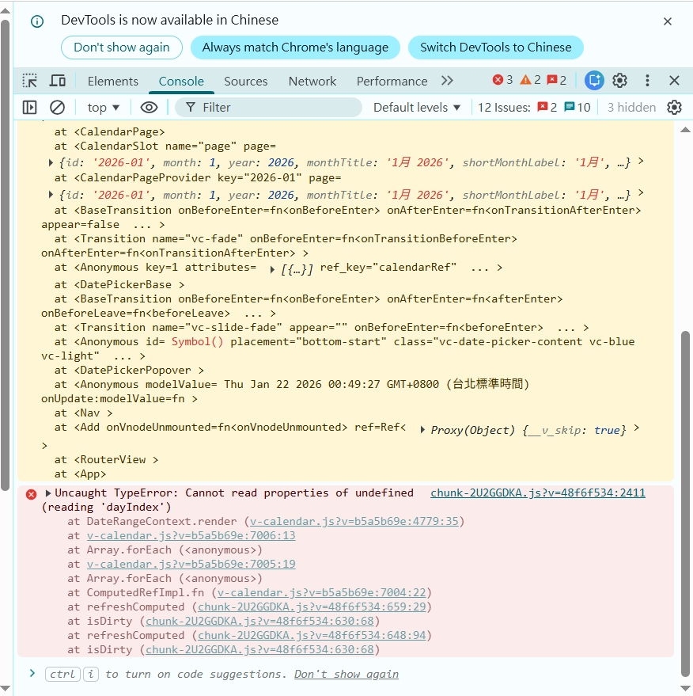

# 專案套件調整說明：v-calendar 降級至 v3.0.1
[回首頁](../README.md)<br>
本文件說明為何我們需要將 v-calendar 套件從 v3.1.2 降級至 v3.0.1。此調整主要是為了解決在 Vue 3.5+ 環境下頻發的運行時錯誤（Runtime Error），以確保日曆組件的穩定性。    
編寫日期： 2026-01-11

## 問題描述 (Problem)
目前 Vue 3 所使用的版本(v3.5.26) ，在使用 DatePicker 時會不定期觸發以下崩潰錯誤：
```text
Uncaught TypeError: Cannot read properties of undefined (reading 'dayIndex')
```

此錯誤通常發生在：
1. 點擊選擇日期時。
2. 切換月份或執行範圍選取 (Range Selection) 時。
3. 組件嘗試重新渲染日期單元格，但底層數據對象尚未初始化完成。

## 根本原因分析 (Root Cause)
1. Vue 3.5 響應式系統重構：    
Vue 3.5 對 computed 與 watcher 的內存管理及觸發機制進行了重大的底層優化。v-calendar 在 v3.0.3 之後引入的部分內部狀態管理邏輯，與 Vue 3.5 的新調度算法產生了競爭條件（Race Condition）。
2. 渲染路徑衝突：    
在 v3.1.x 版本中，日曆渲染依賴於一組複雜的內部索引。當 Vue 3.5 執行快速渲染更新時，組件試圖在舊的渲染視圖被銷毀前讀取新的索引數據，導致 day 對象變成 undefined。
3. 穩定性差異：    
經過社群測試與追蹤，v3.0.1 版本的內部邏輯相對單純，未受此響應式更新的影響，在 Vue 3.5+ 環境下表現最為穩定。

## 解決方案 (Action Plan)
1. 調整版本依賴
使用 pnpm 強制指定安裝 v3.0.1 版本：
```bash
pnpm add v-calendar@3.0.1
```

2. 鎖定版本
在`package.json`中，請確保版本號前不要帶有`^`符號，以防止自動升級回有問題的版本：
```json
"dependencies": {
  "v-calendar": "3.0.1"
}
```

## 後續追蹤 (Future Work)
- 監控官方修復： 持續追蹤 v-calendar GitHub Issues，等待官方發布完整兼容 Vue 3.5+ 的 v3.2.0 或更高版本。
- 替代方案評估： 若官方長期未修復，評估是否切換至其他 UI 庫（如 Element Plus 或 Naive UI）的 DatePicker 組件。

## 錯誤訊息截圖
